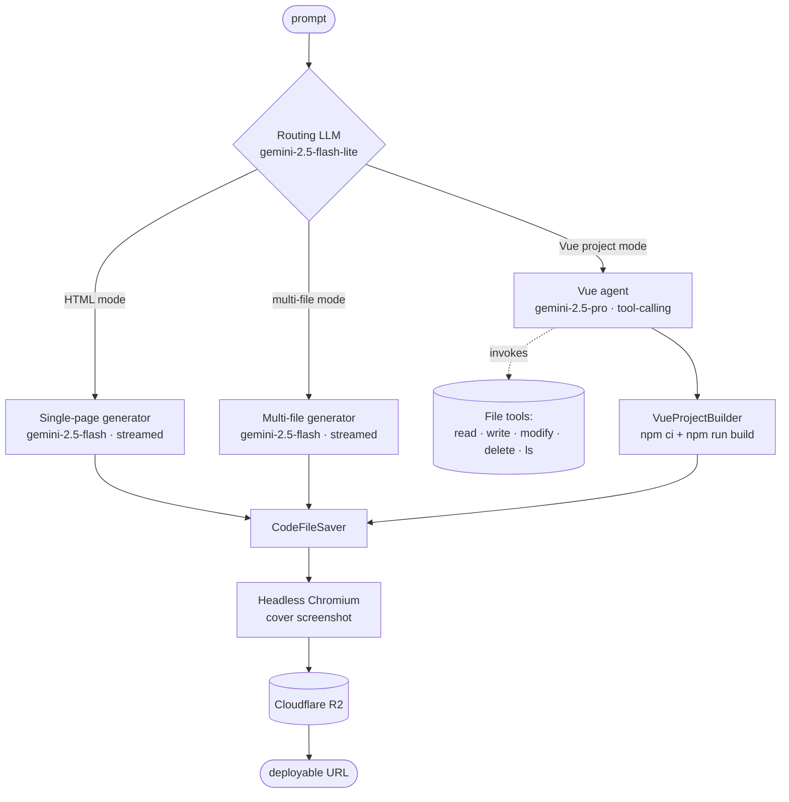

# ai-code — Prompt-to-app code generator

<p align="center">
  
  
  
  
  
  
  
  
</p>

> A prompt-to-app code generator. One LangChain4j router picks an output mode (HTML / multi-file / full Vue project), three Gemini variants are sized to the task, a tool-calling agent scaffolds Vue projects file-by-file, the response streams to the browser over SSE, per-app chat memory is backed by Redis with a MySQL fallback, and headless-Chromium screenshots auto-upload to Cloudflare R2. Spring Boot 3 + LangChain4j 1.13 on the back, Vue 3 + Ant Design Vue on the front.

## Try it live

**<https://ai-code.zxuhan.me/>**

Sign up with any account — no payment, no quota gating. Admin role unlocks the user / app / chat-history dashboards under `/admin/*`.

---

## Architecture



A request enters `AiCodeGeneratorFacade.generateAndSaveCodeStream(...)`. The cheap routing model (`flash-lite`) classifies the prompt. The dispatcher then either streams plain text through a code parser (HTML / multi-file) or hands the request to a tool-calling agent (Vue). On completion the saver writes files to disk, the screenshot service captures a cover image, and `R2Manager` uploads it to Cloudflare R2. Total cost per request: one cheap routing call + one streaming generation; only the Vue mode pays for the bigger `pro` model.

---

## The generators

| Mode | Model | What it does | Output |
|------|-------|--------------|--------|
| `HTML` | gemini-2.5-flash | Streams a single self-contained `.html` file with inline CSS + JS. Parsed by `HtmlCodeParser`. | One file |
| `MULTI_FILE` | gemini-2.5-flash | Streams `index.html`, `style.css`, `script.js` as labeled blocks. `MultiFileCodeParser` splits on the markers. | Three files |
| `VUE_PROJECT` | gemini-2.5-pro | Agent uses LangChain4j tool calling to scaffold a complete Vue 3 project — components, router, stores, vite config — by repeatedly invoking `FileWriteTool`, `FileModifyTool`, etc. `VueProjectBuilder` then runs `npm ci && npm run build`. | Full project + built `dist/` |

The mode for a request is chosen automatically by `AiCodeGenTypeRoutingService` (a separate `@AiService`-generated interface backed by the lite model). Users can also override it explicitly per-app.

---

## Tool-calling Vue scaffolding

Vue projects don't fit one streaming response — they need many files written in a coordinated way. Instead of asking the LLM to print the whole project as text, the Vue agent gets a toolbelt and works incrementally:

| Tool | Spec | Used for |
|------|------|---------|
| `FileWriteTool` | `(relativePath, content)` | New file creation |
| `FileModifyTool` | `(relativePath, oldText, newText)` | Surgical edits |
| `FileDeleteTool` | `(relativePath)` | Cleanup of intermediate files |
| `FileReadTool` | `(relativePath)` | Inspect previous output |
| `FileDirReadTool` | `(relativeDir)` | List directory contents |

Each tool extends `BaseTool`, validates paths against the per-app working directory (no traversal), and returns a structured result the agent can reason over. `ToolManager` wires them all into the `AiServices.builder(...).tools(...)` call. A `hallucinatedToolNameStrategy` returns a clean error message back to the model when it invents tool names, instead of crashing the request.

The agent finishes when it stops emitting tool calls. `VueProjectBuilder` then runs `npm ci && npm run build`, captures stderr on failure, and surfaces a buildable `dist/`.

---

## Streaming over SSE

LangChain4j has two streaming primitives — `Flux<String>` for plain text and `TokenStream` for tool-aware sessions. ai-code uses both, bridged to a single SSE endpoint:

- **HTML / multi-file** — the AI service returns `Flux<String>`. `processCodeStream(...)` taps it with `doOnNext` to accumulate the full text, and `doOnComplete` to parse + save once the stream ends. Chunks pass straight through to the client.
- **Vue project** — the AI service returns `TokenStream`. `processTokenStream(...)` wraps it in `Flux.create`, then attaches:
  - `onPartialResponse` → JSON `AiResponseMessage` chunks (the agent's reasoning text)
  - `onPartialToolCall` → JSON `ToolRequestMessage` (tool args streaming in piece by piece — new in LangChain4j 1.13's redesigned tool-call API)
  - `onToolExecuted` → JSON `ToolExecutedMessage`
  - `onCompleteResponse` / `onError` → terminate the Flux

Both modes share a single SSE controller — the client renders raw text for HTML mode and switch-renders the typed JSON messages for Vue mode (writing-tool indicators, tool-result panels).

---

## Per-app chat memory

Each app id gets its own conversation context. The challenge: LangChain4j's `AiServices` instances are expensive to construct (they wire up the model, the tool manager, the chat-memory provider, and any guardrails), but you also can't share one across apps without leaking history.

```text
buildCacheKey(appId, codeGenType)
                │
                ▼
   ┌─────────────────────────────┐
   │  Caffeine LRU                │  size: 1000
   │  AiCodeGeneratorService …    │  expireAfterWrite: 30m
   └─────────────────────────────┘  expireAfterAccess: 10m
                │ miss
                ▼
   ┌─────────────────────────────┐
   │  MessageWindowChatMemory     │  maxMessages: 20
   │  · RedisChatMemoryStore       │  hot store (TTL on Redis)
   │  · ChatHistoryService.load… │  cold replay from MySQL
   └─────────────────────────────┘
```

On a cache miss the factory builds a fresh `MessageWindowChatMemory` keyed by `appId`, replays the last 20 messages from the `chat_history` MySQL table into it, then constructs the `AiServices` builder. Future requests for the same app reuse the cached service, hit Redis directly, and skip the MySQL replay entirely.

A `removalListener` logs cache evictions so warm-up cost is observable.

---

## Pluggable strategies

The pipeline is split into three swap-in points so adding a new generation mode is a matter of adding three classes — not editing a switch in five places:

| Step | Pattern | Implementations | Dispatcher |
|------|---------|-----------------|-----------|
| Parse stream | Strategy | `HtmlCodeParser`, `MultiFileCodeParser` | `CodeParserExecutor` |
| Save to disk | Template method | `HtmlCodeFileSaverTemplate`, `MultiFileCodeFileSaverTemplate` (extend `CodeFileSaverTemplate`) | `CodeFileSaverExecutor` |
| Stream-back to client | Strategy | `SimpleTextStreamHandler` (plain text), `JsonMessageStreamHandler` (typed events) | `StreamHandlerExecutor` |

`CodeGenTypeEnum` is the single source of truth — every executor switches on it.

---

## Auto-screenshot + R2 deploy

When generation finishes, `ScreenshotService.generateAndUploadScreenshot(...)` is fired:

1. `WebScreenshotUtils` boots a single static `ChromeDriver` (lazy-init, headless, `--no-sandbox`, `--disable-dev-shm-usage`) — picks up `CHROME_BIN` and `CHROMEDRIVER_PATH` env vars when running in the Alpine Docker image so it skips WebDriverManager's glibc-only chromedriver downloader.
2. Hits `document.readyState === 'complete'`, takes a PNG, then re-encodes through Hutool's `ImgUtil.compress` at 30% quality (PNG → JPEG, ~80% size reduction).
3. `R2Manager` (AWS SDK v2 `S3Client` against the Cloudflare R2 endpoint) uploads with path-style addressing under `screenshots/yyyy/MM/dd/<uuid>_compressed.jpg`.
4. The public URL goes back on the `App` row as the cover image.

Deployment is the same flow but for the whole built artifact — `ProjectDownloadServiceImpl` zips the project on demand for download.

---

## Tech stack

| Layer    | Stack |
|----------|-------|
| Backend  | Java 21 · Spring Boot 3.5.4 · LangChain4j 1.13.1 · `langchain4j-google-ai-gemini-spring-boot-starter` 1.13.1-beta23 · Spring Session Redis · MyBatis-Flex · AWS SDK v2 (S3) · Selenium 4 · WebDriverManager · Hutool · Knife4j · Lombok |
| LLM      | Gemini 2.5 Flash-Lite (routing) · 2.5 Flash (HTML / multi-file streaming) · 2.5 Pro (tool-calling Vue agent) |
| Storage  | MySQL 8 · Redis (sessions + LangChain4j chat memory) · Cloudflare R2 (S3-compatible, screenshots & generated apps) |
| Frontend | Vue 3.5 · TypeScript 5.8 · Vite 7 · Pinia · Vue Router · Ant Design Vue 4.2 · Axios · markdown-it + highlight.js |
| Infra    | Alpine multi-stage Docker images (with embedded headless Chromium for screenshots) · Docker Compose (local: 4-service stack ; prod: backend + frontend joining a sibling project's network) · GitHub Actions: build → Docker Hub → SSH deploy |

---

## Run it locally

### Docker Compose (recommended)

```bash
cp .env.example .env
# fill in: GEMINI_API_KEY (required)
#         R2_* (optional — only screenshot upload uses them)
./start.sh                        # or: docker compose up -d --build
```

| Service     | URL                                      |
|-------------|------------------------------------------|
| Frontend    | <http://127.0.0.1:8082>                  |
| Backend API | <http://127.0.0.1:8124/api>              |
| API docs    | <http://127.0.0.1:8124/api/doc.html>     |

MySQL and Redis stay on the internal Docker network. `start.sh` waits for every service to report healthy and prints the URLs.

### Local dev (no Docker)

```bash
# backend
cp src/main/resources/application-local.yml.example src/main/resources/application-local.yml
# fill in API keys
mvn spring-boot:run

# frontend (another shell)
cd frontend && npm install && npm run dev
```

Backend on `:8123/api`, frontend on `:5173`. Vite proxies `/api` to the backend.

---

## Deploy to a 4 GB DO droplet alongside another app

This repo is set up to share an existing droplet's MySQL + Redis with a sibling project (it joins the sibling's docker network as `external`, uses a separate database name `ai_code`, binds to `127.0.0.1:8124` and `127.0.0.1:8082` so the host's Caddy can front it). See `docker-compose.prod.yml` for the wiring and `.github/workflows/deploy.yml` for the build-and-push-and-SSH pipeline.

Memory budget at peak (folio + ai-code + shared mysql/redis + 2× nginx + Docker + OS + Caddy + one in-flight Chromium screenshot) lands at **~3.2 GB on a 4 GB droplet**.

---

## Project layout

```
src/main/java/com/zxuhan/aicode/
├── ai/
│   ├── AiCodeGenTypeRoutingService.java          # routes prompts to a code-gen mode
│   ├── AiCodeGeneratorService.java               # @AiService — 3 generators (HTML / multi-file / Vue)
│   ├── *ServiceFactory.java                      # builds + caches AiService instances per app
│   ├── tools/                                    # FileWrite / Modify / Delete / Read / DirRead + ToolManager
│   └── model/                                    # HtmlCodeResult, MultiFileCodeResult, message DTOs
├── core/
│   ├── AiCodeGeneratorFacade.java                # entry point: generateAndSaveCodeStream(...)
│   ├── builder/VueProjectBuilder.java            # npm install + npm build for Vue mode
│   ├── parser/                                   # HtmlCodeParser, MultiFileCodeParser, executor
│   ├── saver/                                    # template-method file savers + executor
│   └── handler/                                  # JsonMessage / SimpleText stream handlers
├── service/                                      # App, ChatHistory, Screenshot, ProjectDownload, User
├── controller/                                   # App, ChatHistory, User, Health, StaticResource
├── manager/R2Manager.java                        # S3-compatible upload to Cloudflare R2
├── utils/WebScreenshotUtils.java                 # Selenium + Chromium screenshots (env-aware for Alpine)
├── annotation/AuthCheck.java                     # @AuthCheck role guard
├── aop/AuthInterceptor.java                      # AOP enforcement
├── config/                                       # CORS · JSON · Redis chat memory · R2 · reasoning model
├── exception/                                    # BusinessException · ErrorCode · GlobalExceptionHandler
└── model/{entity,dto,vo,enums}/
sql/                                              # schema (create_table.sql)
frontend/                                         # Vue 3 + Vite + Ant Design Vue SPA
.github/workflows/deploy.yml                      # CI: build → Docker Hub → SSH deploy
```

---

## Suggested GitHub repo metadata

**About**

> AI code-generation platform: one prompt → working web app. LangChain4j multi-model routing across Gemini 2.5 Flash-Lite/Flash/Pro, tool-calling Vue scaffolding, SSE streaming, per-app chat memory on Redis + MySQL, auto-screenshot to R2.

**Topics**

```
spring-boot · langchain4j · gemini · ai-code-generation · ai-agent
tool-calling · llm · sse · server-sent-events · vue3 · typescript
ant-design-vue · mybatis-flex · cloudflare-r2 · docker · java21
```

---

## License

MIT.
